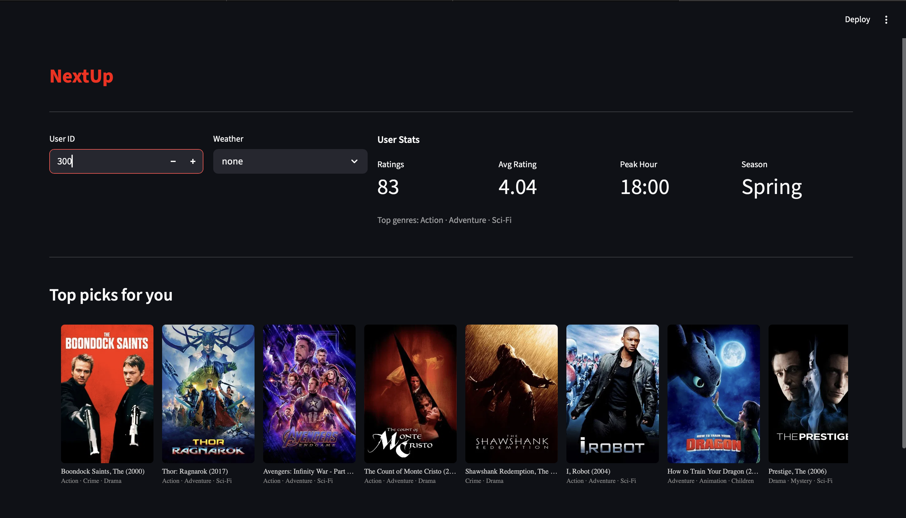
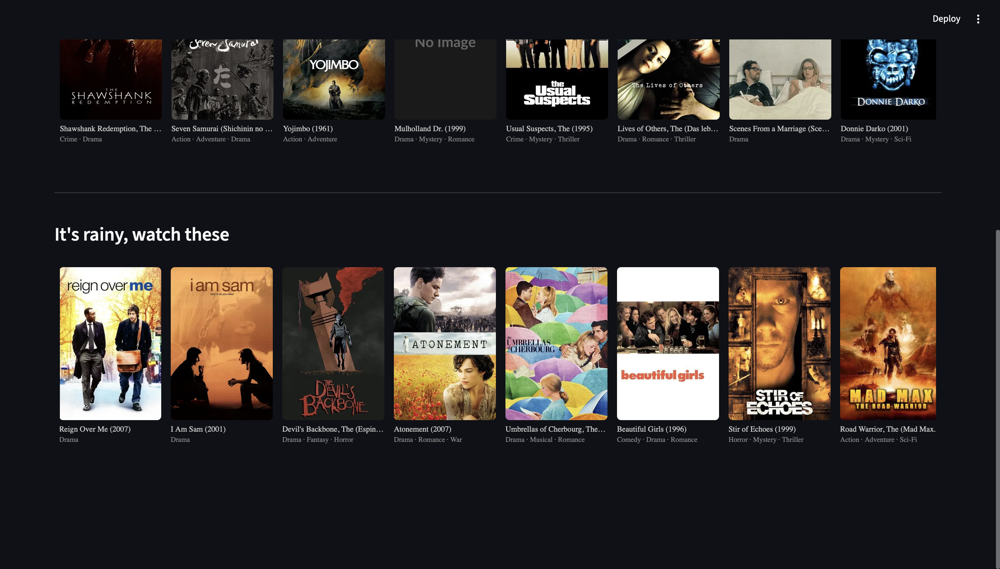

# NextUp

A movie recommendation system built on the MovieLens 25M dataset. Combines a propensity model, collaborative filtering, and time based signals to rank personalized picks. Includes a weather layer that surfaces curated mood based recommendations based on real time local weather.



---

## What it does

- Predicts movies a user is likely to watch using a multi signal scoring pipeline
- Fetches real time local weather via Open Meteo and auto selects the weather condition 
- Displays results in a Netflix style horizontal poster row via a Streamlit UI
- Shows a user stats panel: total ratings, average rating, peak watch hour, peak season, top genres

---

## Dataset

MovieLens 25M - 25 million ratings across 62,000+ movies by 162,000+ users.

Source: [GroupLens](http://grouplens.org/datasets/movielens/)

Download and place contents in the `data/` folder:

```bash
curl -O https://files.grouplens.org/datasets/movielens/ml-25m.zip
unzip ml-25m.zip -d data/
```

> The trained model files (`xgb_model_v2.pkl`, `svd_model.pkl`) and the engineered feature dataset (`full_dataset.parquet`) are not included in this repo. Run the notebooks in order to generate them.

---

## Project structure

```
NextUp/
├── app.py                      # Streamlit app
├── requirements.txt
├── assets/                     # Streamlit Screenshots
├── data/
│   ├── full_dataset.parquet    # Engineered feature dataset (50M rows)
│   ├── movies.csv
│   ├── ratings.csv
│   ├── links.csv
│   ├── xgb_model_v2.pkl        # Trained propensity model
│   └── svd_model.pkl           # Trained SVD model
├── notebooks/
│   ├── 01_EDA.ipynb
│   ├── 02_feature_engineering.ipynb
│   ├── 03_propensity_model.ipynb
│   ├── 04_collaborative_filtering.ipynb
│   ├── 05_ranking_layer.ipynb
│   └── 06_weather_layer.ipynb
└── .streamlit/
    └── secrets.toml            
```

---

## Recommendation pipeline

Each candidate movie is scored using three signals multiplied together:

```
final_score = propensity_score × svd_score × time_score
```

**Signal 1 - Propensity (XGBoost)**
Predicts the probability a user will watch a given movie. Trained on user and movie features including rating patterns, peak activity times, and genre history.

**Signal 2 - Collaborative Filtering (SVD)**
Matrix factorization on the ratings matrix. Captures latent user-movie affinity from rating behavior. Scores are normalized per user before combining.

**Signal 3 - Time Relevance**
Nudges scores based on how well the user's peak watch hour and season match the movie's typical watch patterns. Weighted by how strong the user's pattern is (scales with rating count).

Candidates are pre filtered to movies with 500+ ratings before scoring.

---

## Weather layer

Separate from the main recommender. Does not interact with the scoring pipeline.

Real time weather is fetched from [Open-Meteo](https://open-meteo.com/) on app load and auto selects the weather condition. When a condition is active, a curated row appears below the main picks. Movies are filtered by weather appropriate genres and a minimum average rating of 3.5, then randomly sampled so the row varies each session.



| Condition | Genres |
|-----------|--------|
| Rainy | Drama, Romance, Thriller, Mystery, Film-Noir |
| Snowy | Animation, Children, Fantasy, Musical, Comedy |
| Sunny | Action, Adventure, Comedy |

---

## Tech stack

- Python, pandas, NumPy
- XGBoost - propensity model
- Cornac (SVD) - collaborative filtering
- Streamlit - UI
- TMDB API - movie posters
- Open-Meteo API - real time weather 

---

## Setup

```bash
# Clone and install
pip install -r requirements.txt

# Add TMDB API key
# Create .streamlit/secrets.toml and add:
# TMDB_API_KEY = "your_key_here"

# Download dataset (then run notebooks to generate models + full_dataset.parquet)
curl -O https://files.grouplens.org/datasets/movielens/ml-25m.zip
unzip ml-25m.zip -d data/

# Run
streamlit run app.py
```

---

## What's next

- Genre affinity signal in the scoring pipeline (current recs skew toward universally popular films regardless of user taste)
- Explore models beyond SVD - Bayesian Personalized Ranking, NMF, neural collaborative filtering
- Better propensity model evaluation - realistic ROC curve, precision@K, NDCG
- Deployment strategy for large model and data files
